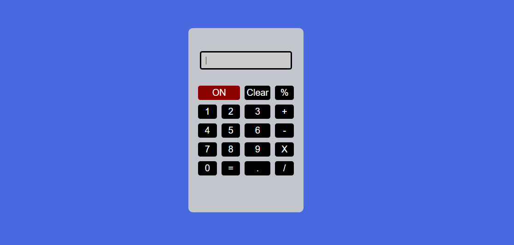

Projeto simples de uma calculadora feita em HTML5 e CSS3, desenvolvida apenas para treinar os conceitos do CSS Grid, como a forma de construção do layout da calculadora usando o CSS Grid para formatar em colunas os botões da calculadora.

Tecnologias usadas: HTML5 e CSS3.

